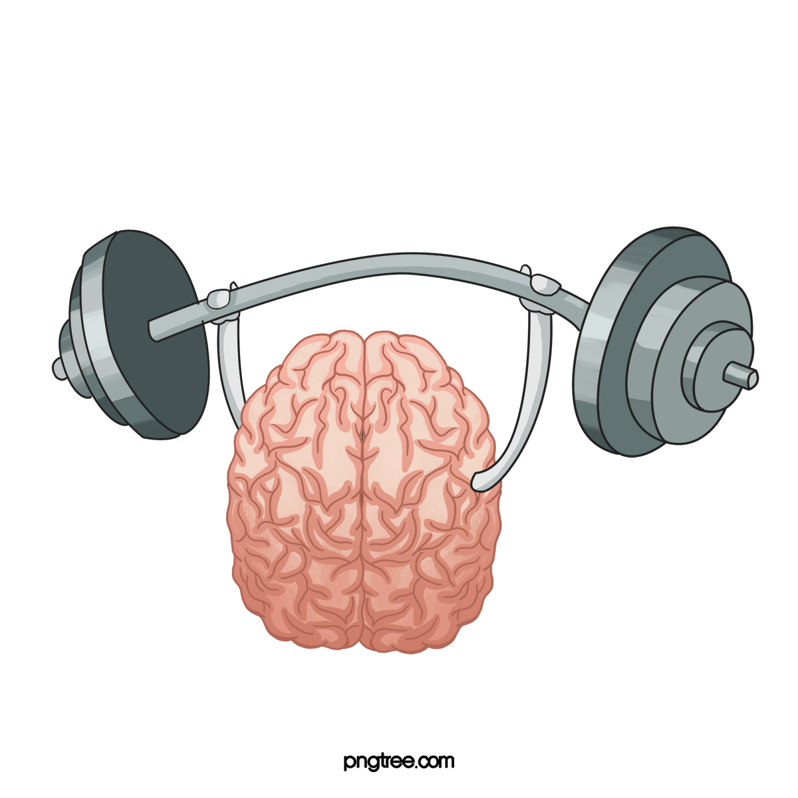

<p align="center">
  
</p>

<h1 align="center">⚡ Akhada Analytics</h1>

<p align="center">
  <strong>Your Personal Fitness Intelligence Platform</strong><br/>
  <em>Track, Analyze, Dominate Your Training Data</em>
</p>

<p align="center">
  
  
  
  
  
</p>

<p align="center">
  <a href="https://github.com/sachinsharmaa07/Akhada-Anlaytics/actions/workflows/ci.yml">
    
  </a>
  <a href="https://github.com/sachinsharmaa07/Akhada-Anlaytics/actions/workflows/deploy.yml">
    
  </a>
  
  
  
</p>

---

## 🎯 What is Akhada Analytics?

**Akhada Analytics** is a full-stack fitness tracking platform that transforms your raw workout data into actionable insights. Whether you're a powerlifter tracking PRs, a bodybuilder monitoring muscle gains, or an endurance athlete optimizing training, Akhada gives you the data science approach to fitness.

> *"Akhada"* (अखाड़ा) — a traditional Indian wrestling arena where warriors train with discipline and purpose. We believe in the same philosophy: **data-driven, goal-oriented training**.

### 💡 Philosophy
- **Simplicity First** — Log workouts in seconds, not minutes
- **Visual Intelligence** — See patterns in your data instantly
- **Science-Backed** — Nutrition tracking aligned with macronutrient science
- **Privacy Focused** — Your data stays on your server (self-hosted option available)

---

## ✨ Core Features

### 🏋️ Workout Tracking
- **Exercise Logging** — Log exercises from a catalog of 1000+ exercises with images
- **Progressive Overload** — Track weight, reps, sets across sessions
- **Personal Records (PRs)** — Automatically detect and celebrate your PRs
- **Workout Templates** — Create and reuse custom workout routines
- **Muscle Group Mapping** — See which muscles you're targeting visually
- **Historical Analytics** — Review your training timeline with heatmaps

### 🥗 Nutrition Tracking
- **Food Database** — Access to 10,000+ foods (European, Indian, US cuisines)
- **Macronutrient Tracking** — Monitor protein, carbs, fats with visual rings
- **Calorie Counting** — Set daily targets and track adherence
- **Meal Logging** — Quick log meals by weight (grams/oz)
- **Supplement Tracking** — Log vitamins and supplements
- **Daily Summary** — See macro breakdown at a glance

### 📊 Analytics Dashboard
- **Strength Metrics** — Max lifts, total volume, 1RM estimates
- **Progress Charts** — Interactive graphs with Recharts (30-day, 90-day, yearly)
- **Body Visualization** — Visual rep heat maps showing muscle engagement
- **Goal Tracking** — Set goals and monitor weekly progress
- **Performance Trends** — Identify weak points and plateaus

### 👤 User Management
- **Authentication** — Email/password with bcrypt hashing
- **Google OAuth 2.0** — One-click sign-in with Google
- **Profile Customization** — Height, weight, age, fitness goals
- **Session Management** — JWT with refresh token rotation
- **Data Privacy** — Secure, encrypted password storage

---

## 🏗️ Architecture

### System Design

```
┌─────────────────────────────────────────────────────────────────────┐
│                        User Browser (Desktop/Mobile)                 │
└────────────────────────────┬──────────────────────────────────────────┘
                             │ HTTPS
                    ┌────────▼─────────┐
                    │ akhada.duckdns.org│
                    │  (DuckDNS DNS)    │
                    └────────┬─────────┘
                             │
                    ┌────────▼────────────────────────┐
                    │ AWS EC2 Instance (Ubuntu 24.04) │
                    │ IP: 13.127.145.141              │
                    │                                 │
                    │  ┌──────────────────────────┐   │
                    │  │  Nginx (Port 80)         │   │
                    │  │  • Reverse Proxy         │   │
                    │  │  • Rate Limiting         │   │
                    │  │  • Security Headers      │   │
                    │  │  • Gzip Compression      │   │
                    │  └──────┬──────┬────────────┘   │
                    │         │      │                │
          /api/     │         │      │  /             │
    ┌─────────────┐ │  ┌──────▼──┐  │  ┌────────────┐│
    │   Backend   │◄─┼─►│ Docker  │  └─►│   Client   ││
    │  Node.js    │ │  │ Network │     │ React +   ││
    │  Port 5001  │ │  │         │     │ Nginx     ││
    └──────┬──────┘ │  └────┬────┘     └────────────┘│
           │        │       │                        │
    ┌──────▼────────┤   ┌───▼──────────────────────┐ │
    │  MongoDB      │   │ Docker Compose           │ │
    │  Port 27017   │   │  Orchestrates 4 services │ │
    │  (Persistent  │   │  • auto-restart          │ │
    │   Volume)     │   │  • network isolation     │ │
    │               │   │  • health checks         │ │
    └───────────────┘   └──────────────────────────┘ │
                    │                                 │
                    └─────────────────────────────────┘
```

### Technology Stack

| Component | Technology | Why This? |
|-----------|-----------|-----------|
| **Frontend Framework** | React 19 + JSX | Fast, component-based, huge ecosystem |
| **Frontend State** | Zustand | Minimal boilerplate, lightweight (~2KB) |
| **Data Visualization** | Recharts | Responsive charts with zero config |
| **Animations** | Framer Motion | Smooth, declarative motion library |
| **HTTP Client** | Axios | Promise-based, request/response interceptors |
| **Backend Framework** | Express 5 | Lightweight, flexible, ideal for REST APIs |
| **Database** | MongoDB 7 | Flexible schema, scales horizontally |
| **ODM** | Mongoose | Schema validation, middleware hooks |
| **Auth Strategy** | JWT + Refresh Tokens | Stateless, secure, mobile-friendly |
| **Social Auth** | Google OAuth 2.0 | Reduces friction, secure, industry standard |
| **API Documentation** | RESTful with endpoints | Easy to test, extends easily |
| **Containerization** | Docker + Docker Compose | Consistent dev/prod environments |
| **Web Server** | Nginx | Reverse proxy, rate limiting, compression |
| **CI/CD** | GitHub Actions | Native to GitHub, free for public repos |
| **Image Registry** | Docker Hub | Reliable, fast, wide adoption |
| **Cloud Provider** | AWS EC2 | Flexible, pay-as-you-go, extensive services |
| **Domain/DNS** | DuckDNS | Free, dynamic DNS with webhooks |

---

## 🚀 How It Works

### 1️⃣ User Registration & Login

```
Step 1: User signs up (email + password OR Google OAuth)
        ↓
Step 2: Password hashed with bcrypt, stored in MongoDB
        ↓
Step 3: JWT access token (15 min) + refresh token (7 days) issued
        ↓
Step 4: Refresh token stored in HTTP-only cookie
        ↓
Step 5: Access token used in Authorization header for API calls
```

**Key Security:**
- Passwords never sent in plain text (HTTPS required)
- Refresh tokens invalidated on logout
- JWT signed with HS256 algorithm
- Token leakage mitigated via short access token TTL

---

### 2️⃣ Logging a Workout

```
Step 1: User selects exercise from 1000+ catalog
        ↓
Step 2: Logs weight, reps, sets, notes
        ↓
Step 3: Frontend validates input (weight > 0, reps > 0)
        ↓
Step 4: POST /api/workout with JWT token
        ↓
Step 5: Backend verifies token, saves to MongoDB
        ↓
Step 6: If new max weight → mark as PR
        ↓
Step 7: Real-time UI updates with toast notification
```

**Data Structure (MongoDB):**
```json
{
  "_id": "ObjectId",
  "userId": "user123",
  "exercise": "Barbell Bench Press",
  "weight": 100,
  "reps": 5,
  "sets": 3,
  "notes": "Feeling strong today",
  "muscleGroups": ["Chest", "Triceps"],
  "timestamp": "2026-05-11T12:00:00Z",
  "isWeeklyPR": true,
  "isPR": false
}
```

---

### 3️⃣ Analytics Dashboard

```
Step 1: User navigates to /analytics
        ↓
Step 2: Frontend fetches user's workout history (GET /api/workout)
        ↓
Step 3: Backend aggregates data:
        • Total volume (weight × reps × sets)
        • Max lifts per exercise
        • Weekly averages
        • PR timeline
        ↓
Step 4: Recharts renders interactive charts (30-day, 90-day, 1-year views)
        ↓
Step 5: Heatmap shows muscle group engagement distribution
        ↓
Step 6: Progress ring displays weekly goal vs. actual
```

**Real-Time Updates:** Zustand store instantly updates UI when new workouts logged.

---

### 4️⃣ Nutrition Tracking

```
Step 1: User searches food (e.g., "Chicken Breast")
        ↓
Step 2: API queries local food database (10K+ foods)
        ↓
Step 3: User enters serving weight (100g)
        ↓
Step 4: Calories + macros auto-calculated
        ↓
Step 5: Logged to /api/nutrition with timestamp
        ↓
Step 6: Daily totals aggregated, visualized with macro rings
```

**Macro Ring Formula:**
```
Ring Color = {
  Protein: #FF6B6B (red),
  Carbs:   #4ECDC4 (teal),
  Fats:    #FFE66D (yellow)
}

Ring Fill % = (Logged / Daily Goal) × 100
```

---

## 🔐 Security & Privacy

| Layer | Measure |
|-------|---------|
| **In Transit** | HTTPS/TLS 1.3 (enforced by nginx) |
| **At Rest** | MongoDB encryption, bcrypt password hashing (10 rounds) |
| **Authentication** | JWT with HS256 signature, short-lived tokens |
| **Authorization** | `authMiddleware` verifies JWT on protected routes |
| **CORS** | Whitelist `akhada.duckdns.org`, `localhost:3000` |
| **Rate Limiting** | Nginx limits 30 req/s, burst 50 on `/api/*` |
| **Injection** | Mongoose schema validation prevents NoSQL injection |
| **Data Validation** | Input sanitized with `express-validator` |
| **Secrets** | Never committed; injected via `.env` / GitHub Secrets |

---

## 📱 User Interface

### Pages & Routes

| Route | Component | Features |
|-------|-----------|----------|
| `/` | Home | Welcome screen, quick stats |
| `/login` | Login | Email/password + Google OAuth |
| `/register` | Register | Sign up form with validation |
| `/workout` | Workout Logger | Exercise search, log interface |
| `/workout-log` | Workout History | Table view, filter by date/exercise |
| `/nutrition` | Nutrition Tracker | Food search, daily summary |
| `/analytics` | Dashboard | Charts, heatmaps, progress rings |
| `/profile` | User Profile | Settings, personal info, goals |
| `/onboarding` | Onboarding | First-time user flow (goals, units) |

### UI Components

| Component | Purpose |
|-----------|---------|
| `Navbar` | Top navigation, user menu, logout |
| `BodyVisualizer` | 3D-like muscle group heatmap |
| `MacroRing` | Circular progress for macros |
| `MuscleHeatMap` | Weekly muscle engagement chart |
| `Skeleton` | Loading state placeholder |
| `Toast` | Success/error notifications |
| `ProtectedRoute` | Guard unauthenticated access |

---

## 🌍 Deployment

### Production URL
```
🌐 http://akhada.duckdns.org
```

### Deployment Pipeline

**Every push to `main` triggers:**

```
1. GitHub Actions CI
   ├─ Backend: npm ci, syntax check
   ├─ Client: npm ci, npm run build, tests
   └─ Docker: Build + validate images

2. Docker Hub Push
   ├─ sachinsharmaa07/akhada-backend:latest + :sha
   └─ sachinsharmaa07/akhada-client:latest + :sha

3. EC2 Auto-Deploy
   ├─ SSH into 13.127.145.141
   ├─ Pull latest images from Docker Hub
   ├─ docker compose up -d --remove-orphans
   ├─ Health check: curl /api/health
   └─ Cleanup old images

⏱️ Typical deploy time: 4-8 minutes (fully automated)
```

### Local Development

```bash
# Clone
git clone https://github.com/sachinsharmaa07/Akhada-Anlaytics.git
cd Akhada-Anlaytics

# Install dependencies
npm install
cd client && npm install && cd ..

# Start (with Docker Compose)
docker compose up -d

# OR start manually
# Terminal 1: mongod (MongoDB)
# Terminal 2: npm run dev (backend on :5001)
# Terminal 3: cd client && npm start (frontend on :3000)
```

---

## 📊 Database Schema

### Collections

#### Users
```javascript
{
  _id: ObjectId,
  email: String (unique),
  passwordHash: String (bcrypt),
  googleId: String (optional, unique),
  firstName: String,
  lastName: String,
  height: Number (cm),
  weight: Number (kg),
  age: Number,
  goals: [String], // ["strength", "hypertrophy", "endurance"]
  preferredUnits: String, // "metric" or "imperial"
  createdAt: Date,
  updatedAt: Date
}
```

#### Workouts
```javascript
{
  _id: ObjectId,
  userId: ObjectId (ref: Users),
  exercise: String,
  weight: Number,
  reps: Number,
  sets: Number,
  notes: String,
  muscleGroups: [String],
  timestamp: Date,
  isWeeklyPR: Boolean,
  isPR: Boolean
}
```

#### NutritionLogs
```javascript
{
  _id: ObjectId,
  userId: ObjectId,
  foodName: String,
  serving: Number (grams),
  calories: Number,
  protein: Number (g),
  carbs: Number (g),
  fats: Number (g),
  timestamp: Date,
  timestamp: Date
}
```

#### PersonalRecords
```javascript
{
  _id: ObjectId,
  userId: ObjectId,
  exercise: String,
  maxWeight: Number,
  reps: Number,
  achievedAt: Date
}
```

---

## 🤝 Contributing

We welcome contributions! Please:

1. Fork the repository
2. Create a feature branch (`git checkout -b feature/amazing-feature`)
3. Commit your changes (`git commit -m 'Add amazing feature'`)
4. Push to the branch (`git push origin feature/amazing-feature`)
5. Open a Pull Request

### Development Checklist
- [ ] All tests pass (`npm test`)
- [ ] No console errors
- [ ] Code follows project style
- [ ] Backend + frontend compile without warnings
- [ ] Updated relevant docs

---

## 📄 License

This project is licensed under the ISC License — see [LICENSE](LICENSE) for details.

---

## 👨‍💻 Author

**Sachin Sharma**
- GitHub: [@sachinsharmaa07](https://github.com/sachinsharmaa07)
- Project: [Akhada Analytics](https://github.com/sachinsharmaa07/Akhada-Anlaytics)

---

## 🙏 Acknowledgments

- **Recharts** — Data visualization magic
- **Framer Motion** — Beautiful animations
- **MongoDB** — Reliable NoSQL database
- **Express.js** — Minimalist web framework
- **React 19** — Modern UI library
- **Docker** — Containerization standard
- **GitHub Actions** — CI/CD automation

---

<p align="center">
  <strong>Made with ❤️ for fitness enthusiasts and data nerds</strong>
</p>

<p align="center">
  <a href="https://github.com/sachinsharmaa07/Akhada-Anlaytics">⭐ Star this repo if you find it useful!</a>
</p>

CLIENT_URL=https://your-domain
GOOGLE_CLIENT_ID=your_google_client_id
GOOGLE_CLIENT_SECRET=your_google_client_secret
```

### Deploy on EC2

```bash
docker compose pull
docker compose up -d
```

Expose port 3000 (and 5001 only if you need direct API access). For a custom domain, put a reverse proxy in front of the client container and set `CLIENT_URL` to the public URL.

---

## ⚙️ CI/CD — GitHub Actions

Two workflows automate testing and deployment on every push:

### CI — Test & Build (`.github/workflows/ci.yml`)

Runs on every **push** and **pull request**:

| Job | What it does |
|-----|--------------|
| 🔧 **Backend** | Install deps, syntax-check `server.js`, verify all route modules resolve |
| ⚛️ **Client** | Install deps, production build, run React tests |
| 🐳 **Docker** | Validate `docker compose build` succeeds |

### CD — Deploy (`.github/workflows/deploy.yml`)

Runs on push to `main` **after CI passes**:

| Job | Target | Mechanism |
|-----|--------|-----------|
| 🐳 **Build & Push** | Amazon ECR | Docker build + push (backend + client images) |
| 🚀 **Deploy** | AWS EC2 | SSH + `docker compose pull` + `docker compose up -d` |

### Required GitHub Secrets

Add these in **Settings → Secrets and Variables → Actions**:

| Secret | Description |
|--------|-------------|
| `AWS_ACCESS_KEY_ID` | IAM user access key with ECR permissions |
| `AWS_SECRET_ACCESS_KEY` | IAM user secret key |
| `AWS_REGION` | AWS region (for example, `us-east-1`) |
| `AWS_ACCOUNT_ID` | AWS account ID |
| `ECR_REPO_BACKEND` | ECR repository name for backend image |
| `ECR_REPO_CLIENT` | ECR repository name for client image |
| `REACT_APP_API_URL` | Public API base URL baked into client image |
| `REACT_APP_GOOGLE_CLIENT_ID` | Google OAuth client ID for client build |
| `EC2_HOST` | EC2 public host or IP |
| `EC2_USER` | SSH user (for example, `ec2-user`) |
| `EC2_SSH_KEY` | Private key for SSH (PEM contents) |
| `EC2_APP_DIR` | Path to repo on EC2 (for example, `/opt/akhada-analytics`) |

---

## 🔐 Security
| 🏅 **Chris Bumstead** | Chest & Back, Shoulders & Arms, Hamstrings & Glutes, Quads & Calves, Delts & Arms |
| 💪 **Ronnie Coleman** | Chest, Back, Shoulders, Arms, Legs |
| 🔥 **Larry Wheels** | Power Bench, Power Squat, Power Deadlift, Hypertrophy Upper/Lower |
| 🧠 **Jeff Nippard** | Push, Pull, Legs (Science-based) |

Plus **6 quick-start templates**: Push Day, Pull Day, Leg Day, Upper Body, Lower Body, Full Body.

---

## 🛠️ Tech Stack

<table>
<tr>
<td align="center" width="25%"><strong>Frontend</strong></td>
<td align="center" width="25%"><strong>Backend</strong></td>
<td align="center" width="25%"><strong>Database</strong></td>
<td align="center" width="25%"><strong>Deployment</strong></td>
</tr>
<tr>
<td align="center">
React 19<br/>
React Router 7<br/>
Zustand 5<br/>
Recharts 3<br/>
Framer Motion<br/>
Lucide React
</td>
<td align="center">
Node.js<br/>
Express 5<br/>
JWT (Access + Refresh)<br/>
Google OAuth 2.0<br/>
Helmet & Rate Limiting<br/>
bcrypt
</td>
<td align="center">
MongoDB Atlas<br/>
Mongoose 9<br/>
Connection Pooling<br/>
TTL Indexes<br/>
Compound Indexes
</td>
<td align="center">
AWS EC2 (Docker Compose)<br/>
Amazon ECR (Images)<br/>
MongoDB Atlas (DB)<br/>
GitHub Actions CI/CD<br/>
Docker Compose
</td>
</tr>
</table>

---

## 📁 Project Structure

```
Akhada Analytics/
├── .github/
│   └── workflows/
│       ├── ci.yml             # CI — lint, build, test, Docker build
│       └── deploy.yml         # CD — deploy to AWS EC2 + ECR
├── backend/
│   ├── Dockerfile             # Backend Docker image
│   ├── server.js              # Express server entry
│   ├── seed.js                # Exercise database seeder
│   ├── middleware/
│   │   └── authMiddleware.js  # JWT + cookie auth
│   ├── models/
│   │   ├── User.js            # User schema + goals
│   │   ├── Workout.js         # Workout + exercises + sets
│   │   ├── NutritionLog.js    # Daily nutrition logs
│   │   ├── Exercise.js        # Exercise catalog
│   │   ├── PersonalRecord.js  # PR tracking
│   │   └── RefreshToken.js    # Token rotation
│   └── routes/
│       ├── auth.js            # Register, login, Google OAuth, refresh
│       ├── user.js            # Profile & goals
│       ├── workout.js         # CRUD + PR detection + muscle heatmap
│       ├── nutrition.js       # Food logging + daily summary
│       └── food.js            # Multi-cuisine food search
├── client/
│   ├── Dockerfile             # Client Docker image (multi-stage → nginx)
│   ├── .dockerignore
│   ├── src/
│   │   ├── pages/             # 9 pages (Home → Analytics)
│   │   ├── components/        # Reusable UI (Navbar, HeatMap, MacroRing...)
│   │   ├── stores/            # Zustand state (auth, workout, nutrition, toast)
│   │   ├── data/              # 500+ Indian, 200+ US, 200+ EU foods, exercises
│   │   ├── api/               # Axios instance + interceptors
│   │   └── styles/            # CSS modules per page
│   └── public/
├── .dockerignore              # Root Docker ignore
├── docker-compose.yml         # Full-stack local dev (Mongo + Backend + Client)
├── .env.example               # Backend env template
└── package.json
```

---

## 🚀 Quick Start

### Prerequisites
- Node.js 18+
- MongoDB (local or [Atlas](https://cloud.mongodb.com))

### 1. Clone & Install

```bash
git clone https://github.com/sachinsharmaa07/Akhada-Anlaytics.git
cd Akhada-Anlaytics

# Install backend dependencies
npm install

# Install frontend dependencies
cd client && npm install && cd ..
```

### 2. Configure Environment

```bash
cp .env.example .env
```

Edit `.env` with your values:

```env
MONGO_URI=mongodb://localhost:27017/akhada_analytics
PORT=5001
JWT_SECRET=your_secret_here
JWT_REFRESH_SECRET=your_refresh_secret_here
CLIENT_URL=http://localhost:3000
GOOGLE_CLIENT_ID=your_google_client_id
GOOGLE_CLIENT_SECRET=your_google_client_secret
# Optional: comma-separated list if you use multiple Google OAuth client IDs
GOOGLE_CLIENT_IDS=your_web_client_id,your_other_client_id
```

For the frontend (`client/.env`), also set:

```env
REACT_APP_GOOGLE_CLIENT_ID=your_google_client_id
```

### 3. Seed the Exercise Database

```bash
node backend/seed.js
```

### 4. Run (Option A — Manual)

```bash
# Terminal 1 — Backend
npm run dev

# Terminal 2 — Frontend
cd client && npm start
```

Open **http://localhost:3000** 🎉

### 4. Run (Option B — Docker Compose)

Spin up everything with a single command — no local Node.js or MongoDB needed:

```bash
docker compose up --build
```

This starts:
| Container | Port | Description |
|-----------|------|-------------|
| `akhada-mongo` | `27017` | MongoDB 7 with health checks |
| `akhada-backend` | `5001` | Node.js API server |
| `akhada-client` | `3000` | React app served via nginx |

To stop: `docker compose down` · To wipe data: `docker compose down -v`

---

## 🌐 Deployment

| Service | Platform | Config |
|---------|----------|--------|
| **Backend API** | [Render](https://render.com) | `render.yaml` — auto-detected |
| **Frontend** | [Vercel](https://vercel.com) | Root directory → `client` |
| **Database** | [MongoDB Atlas](https://cloud.mongodb.com) | Free M0 cluster |

> Set `REACT_APP_API_URL` on Vercel and `CLIENT_URL` on Render to connect them.
>
> For Google Sign-In, make sure the same `REACT_APP_GOOGLE_CLIENT_ID` is used in frontend env and backend `GOOGLE_CLIENT_IDS`, and add your domains under Google Cloud Console OAuth Web Client "Authorized JavaScript origins" (e.g. `https://akhada-anlaytics.vercel.app` and `http://localhost:3000`).

---

## ⚙️ CI/CD — GitHub Actions

Two workflows automate testing and deployment on every push:

### CI — Test & Build (`.github/workflows/ci.yml`)

Runs on every **push** and **pull request**:

| Job | What it does |
|-----|--------------|
| 🔧 **Backend** | Install deps, syntax-check `server.js`, verify all route modules resolve |
| ⚛️ **Client** | Install deps, production build, run React tests |
| 🐳 **Docker** | Validate `docker compose build` succeeds |

### CD — Deploy (`.github/workflows/deploy.yml`)

Runs on push to `main` **after CI passes**:

| Job | Target | Mechanism |
|-----|--------|-----------|
| 🚀 **Backend** | Render | Deploy Hook (HTTP POST) |
| 🌐 **Client** | Vercel | Vercel CLI (`vercel deploy --prod`) |

### Required GitHub Secrets

Add these in **Settings → Secrets and Variables → Actions**:

| Secret | Where to get it |
|--------|----------------|
| `RENDER_DEPLOY_HOOK_URL` | Render Dashboard → Service → Settings → Deploy Hook |
| `VERCEL_TOKEN` | [vercel.com/account/tokens](https://vercel.com/account/tokens) |
| `VERCEL_ORG_ID` | Run `vercel link` in `client/`, check `.vercel/project.json` |
| `VERCEL_PROJECT_ID` | Same as above |

> **Note:** Both deploy jobs gracefully skip with a helpful message if the secrets are not yet configured.

---

## 🔐 Security

- 🔒 **JWT dual-token system** — 15-min access + 30-day refresh with rotation
- 🍪 **httpOnly cookies** — tokens never exposed to JavaScript
- 🛡️ **Helmet** — secure HTTP headers
- ⏱️ **Rate limiting** — 15 auth requests per 15 minutes
- 🔑 **bcrypt** — password hashing with 12 salt rounds
- 🚫 **Token reuse detection** — revokes entire token family on reuse

---

## 📊 API Endpoints

<details>
<summary><strong>Auth</strong> — <code>/api/auth</code></summary>

| Method | Endpoint | Description |
|--------|----------|-------------|
| `POST` | `/register` | Create account |
| `POST` | `/login` | Email/password login |
| `POST` | `/google` | Google OAuth |
| `POST` | `/onboarding` | Complete profile setup |
| `POST` | `/refresh` | Rotate tokens |
| `POST` | `/logout` | Revoke session |
| `GET` | `/check-username/:username` | Username availability |

</details>

<details>
<summary><strong>Workouts</strong> — <code>/api/workout</code></summary>

| Method | Endpoint | Description |
|--------|----------|-------------|
| `GET` | `/` | Paginated workout list |
| `POST` | `/` | Log new workout (auto PR detection) |
| `GET` | `/:id` | Workout detail |
| `DELETE` | `/:id` | Delete workout |
| `GET` | `/muscles/last7days` | Muscle heatmap data |
| `GET` | `/pr` | Personal records |
| `GET` | `/exercises/search` | Search exercise DB |
| `GET` | `/last-weights` | Last-used weights |

</details>

<details>
<summary><strong>Nutrition</strong> — <code>/api/nutrition</code></summary>

| Method | Endpoint | Description |
|--------|----------|-------------|
| `GET` | `/today` | Today's log + summary |
| `POST` | `/log` | Add food items |
| `DELETE` | `/log/:mealType/:itemIndex` | Remove food item |
| `GET` | `/history` | Multi-day history |
| `GET` | `/vitamins/today` | Vitamin & mineral totals |

</details>

<details>
<summary><strong>Food Search</strong> — <code>/api/food</code></summary>

| Method | Endpoint | Description |
|--------|----------|-------------|
| `GET` | `/search` | USDA Global search |
| `GET` | `/search/indian` | Indian food DB |
| `GET` | `/search/mexican` | Mexican food DB |

</details>

---

## 🍱 Built-in Food Databases

| Cuisine | Items | Categories |
|---------|-------|------------|
| 🇮🇳 Indian | 500+ | Dal, Paneer, Biryani, Roti, Dosa, Sweets... |
| 🇺🇸 American | 200+ | Burgers, Steaks, Salads, Smoothies... |
| 🇪🇺 European | 200+ | French, Italian, German, Spanish, Greek... |
| 🌎 Global | Unlimited | USDA FoodData Central API |

---

## 🤝 Contributing

Contributions are welcome! Feel free to:

1. Fork the repo
2. Create a feature branch (`git checkout -b feature/amazing-feature`)
3. Commit your changes (`git commit -m 'Add amazing feature'`)
4. Push to the branch (`git push origin feature/amazing-feature`)
5. Open a Pull Request

---

## 📜 License

This project is licensed under the **ISC License**.

---

<p align="center">
  <strong>Built with 💪 by <a href="https://github.com/sachinsharmaa07">Sachin Sharma</a></strong>
</p>

<p align="center">
  <sub>If you found this useful, consider giving it a ⭐</sub>
</p>
